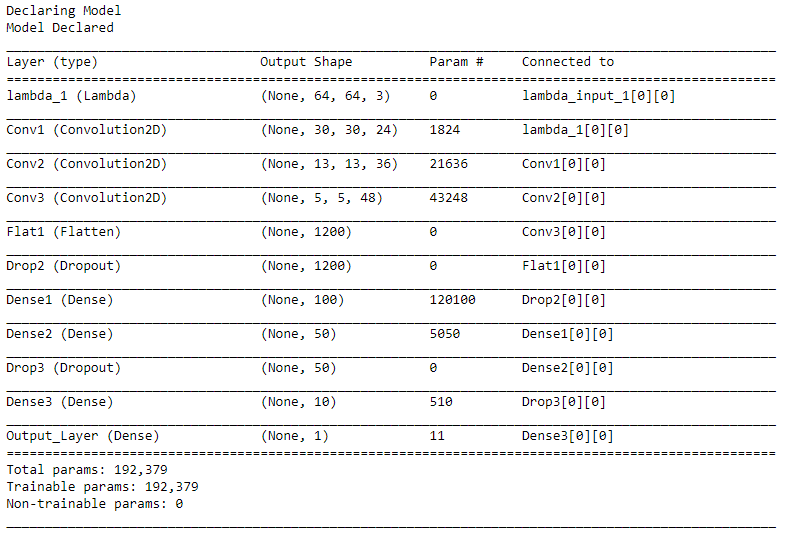
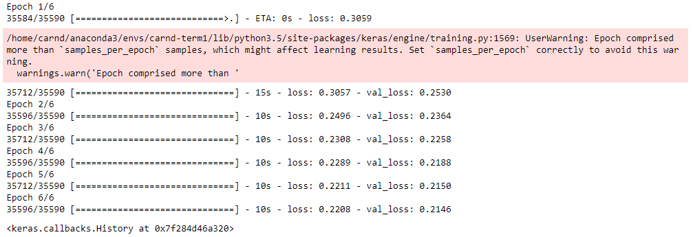

# Vehicle Detection

In this project, your goal is to write a software pipeline to detect vehicles in a video (start with the test_video.mp4 and later implement on full project_video.mp4), but the main output or product we want you to create is a detailed writeup of the project.  Check out the [writeup template](https://github.com/udacity/CarND-Vehicle-Detection/blob/master/writeup_template.md) for this project and use it as a starting point for creating your own writeup.  

## Classification Model Used: CNN
The classifier used for this project is created Using CNN. I tried with the methods suggested by Udacity but they didn't worked out very well. Please see the discussion section for more information on this. 
I used Convolution Neural Network and trained it with the Vehicle and Non-vehicle data provided by Udacity. Code for the Model is in Model.ipynb.

#### Data Augmentation
As CNN works well with more data we need more data. So I decided to augment the data bu flipping it, as flipping the images will just double the data. While horizontal flipping was applied to car and non-car images, vertical flipping can not be applied to car images as this not retain any information. So I decided to vertically flip the non-car images. Thus making the total size of data as below:-
    Number of total Vehicle Images 17584
    Number of total non Vehicle Images 26904
    Number of total Input Data 44488

#### Model Architecture
Model used has below architecture:-

#### Training Model
To train the Model I used generator to pass the data in batches. I used 20% of the data as test data.Then the model was saved so that we can use it for predicting the sliding windows.

### Sliding Window Search

#### 1. Describe how (and identify where in your code) you implemented a sliding window search.  How did you decide what scales to search and how much to overlap windows?

I decided to use below window sizes and positions.
|   Window|  Overlapping| Y Start| X Start |
|--:	|---	|---	|---	|
|  64,64 	| .6  	|   400, 600 	| 600, None 	|
|  96,96 	| .6  	| 400, 600 	|   600, None	|
|  128,96 	| .6  	| 400, None  	|600, None   	|

X_start_stop was used from 600 to reduce the compute time. As it was taking very much time to run on pipeline with all the windows. See the dicussion for more details.

#### 2. Show some examples of test images to demonstrate how your pipeline is working.  What did you do to optimize the performance of your classifier?

Below are the test images used for checking the prediction of the model.

---

### Video Implementation

#### 1. Provide a link to your final video output.  Your pipeline should perform reasonably well on the entire project video (somewhat wobbly or unstable bounding boxes are ok as long as you are identifying the vehicles most of the time with minimal false positives.)
Here's a [link to my video result](./project_video.mp4)

#### 2. Describe how (and identify where in your code) you implemented some kind of filter for false positives and some method for combining overlapping bounding boxes.

I recorded the positions of positive detections in each frame of the video.  From the positive detections I created a heatmap and then thresholded that map to identify vehicle positions.  I then used `scipy.ndimage.measurements.label()` to identify individual blobs in the heatmap.  I then assumed each blob corresponded to a vehicle.  I constructed bounding boxes to cover the area of each blob detected.  

Here's an example result showing the heatmap from a series of frames of video, the result of `scipy.ndimage.measurements.label()` and the bounding boxes then overlaid on the last frame of video:

### Here are six frames and their corresponding heatmaps:

![alt text][image5]

### Here is the output of `scipy.ndimage.measurements.label()` on the integrated heatmap from all six frames:
![alt text][image6]

### Here the resulting bounding boxes are drawn onto the last frame in the series:
![alt text][image7]

---

### Discussion

#### 1. Briefly discuss any problems / issues you faced in your implementation of this project.  Where will your pipeline likely fail?  What could you do to make it more robust?

The reason why Hog and SVC was not used for the final input is because of the False Positives which were produced by the LinearSVM classifier. Even after multiple tuning of parameters the output videos were not satisfacotry. These results can be seen in *Failed Results SVC* directory. Even after augmenting the data results were not good on image. Also it was very time consuming to generate the Videos as the  number of windows was 550, so reduce this as suggested by our Session Lead we applied the windows to the lower right part of the image.

